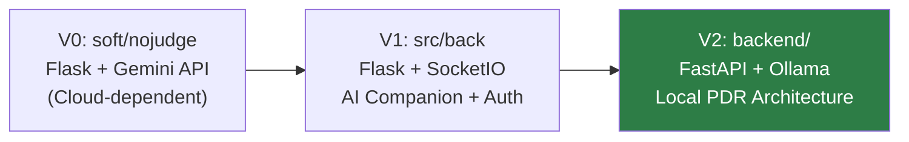

# Nojudge — Product Requirements Document (PRD)

> **Version:** 1.0  
> **Date:** March 3, 2026  
> **Status:** Living Document  

---

## 1. Product Vision

**Nojudge** is a safe-space digital platform where users can express themselves freely — without fear of judgment. It combines **anonymous blogging**, **private journaling**, and an **AI companion ("Sage")** into a single, privacy-first experience backed by a fully local Personal Data Repository (PDR).

### Core Tagline

> *"The new way to talk without judgment."*

### Guiding Principles

| Principle | What it means for Nojudge |
|---|---|
| **Privacy First** | All personal data stays local. No cloud dependency for AI, storage, or conversations. |
| **Zero Judgment** | Users can post anonymously, journal privately, and chat with an AI that never judges. |
| **Local Intelligence** | The AI runs via Ollama on the user's own machine — no data leaves the device. |
| **Simplicity** | A clean, minimal interface inspired by native iOS/mobile aesthetics. |

---

## 2. Target Users

- People who want to express thoughts and feelings without social consequences.
- Journalers seeking a private digital notebook that never syncs to the cloud.
- Users who want an AI friend for casual venting, advice, or emotional support — without their conversations being sent to a third party.

---

## 3. Feature Overview

### 3.1 Anonymous Blog Posting

| Attribute | Detail |
|---|---|
| **What** | Write and publish blog posts without revealing your identity. |
| **Current Status** | Static UI mockups exist in `web/blog.html` and `web/every blog.html`. Not yet connected to any backend. |
| **Scope** | Create, read, and browse blogs. Publish button exists but is non-functional. |

### 3.2 Private Journal

| Attribute | Detail |
|---|---|
| **What** | A personal, private journal with entries grouped by day, week, month, and year. |
| **Current Status** | Static UI mockup in `web/journal.html`. Split-pane layout with search, section headings (Today, Previous 7 days, Previous 30 days, Year). Not connected to backend. |
| **Scope** | Create, search, and browse journal entries. All data stored locally. |

### 3.3 Sage — AI Chat Companion

| Attribute | Detail |
|---|---|
| **What** | A casual, empathetic AI chat partner ("Sage") users can share anything with. |
| **Current Status** | **Fully functional.** FastAPI backend (`backend/main.py`) serving a Jinja2 chat UI (`frontend/templates/chat.html`). Uses local Ollama LLM (model: `qwen2.5-coder:14b`) with RAG-augmented context. Conversations are logged to local SQLite. |
| **Personality** | Talks like a best friend texting at 3 AM — casual, honest, supportive, uses "haha", "omg", "tbh", "fr fr". |

### 3.4 Document Ingestion (PDR)

| Attribute | Detail |
|---|---|
| **What** | Upload `.txt` files into a local vector store so Sage can reference your personal documents when answering questions. |
| **Current Status** | **Functional.** `/ingest` endpoint in `backend/main.py`. Documents are chunked, embedded via `sentence-transformers` (`all-MiniLM-L6-v2`), and stored in a persistent ChromaDB instance at `vector_store/`. |

### 3.5 Coming Soon / Landing Page

| Attribute | Detail |
|---|---|
| **What** | A public-facing "coming soon" page with email-notify form and social links. |
| **Current Status** | Static page exists at `web/coming.html` with email input + Facebook/Twitter/Instagram links. Not connected to any backend or mailing service. |

---

## 4. Current Architecture

```
Nojudge/
├── backend/              ← ACTIVE: FastAPI + Ollama PDR system
│   ├── main.py           ← FastAPI app (chat, ingest endpoints)
│   ├── database.py       ← SQLAlchemy (SQLite), ConversationLog & DocumentMetadata models
│   ├── rag.py            ← ChromaDB + sentence-transformers RAG pipeline
│   └── requirements.txt  ← Python deps (fastapi, chromadb, sentence-transformers, etc.)
│
├── frontend/             ← ACTIVE: Jinja2 templates for the chat UI
│   ├── templates/        ← base.html, chat.html, index.html, error.html
│   └── static/           ← style.css, index.js
│
├── src/back/             ← LEGACY: Flask + SocketIO "AI Companion" prototype
│   └── app.py            ← Flask app with auth, companion blueprints, activity simulator
│
├── soft/nojudge/         ← LEGACY: Original Flask + Gemini API chatbot
│   ├── app.py            ← Flask app using external Google Gemini API
│   ├── templates/        ← Duplicate templates (base, chat, index, error)
│   └── static/           ← Duplicate static assets
│
├── web/                  ← DESIGN: Static HTML/CSS page mockups (gitignored)
│   ├── index.html        ← Main landing page with feature cards
│   ├── blog.html         ← Blog post creation editor
│   ├── every blog.html   ← Blog feed / listing page
│   ├── journal.html      ← Journal view with timeline sections
│   ├── coming.html       ← "Coming Soon" pre-launch page
│   ├── red.html          ← Valentine's Day gift shop concept (unrelated)
│   └── landing page.html ← Next.js/React landing page component (code, not HTML)
│
├── data/                 ← SQLite database (pdr.db)
├── vector_store/         ← ChromaDB persistent storage
├── .env                  ← Flask env vars (FLASK_ENV, SECRET_KEY, DATABASE_URL)
├── package.json          ← npm metadata, start/dev scripts to launch FastAPI via Uvicorn
└── PDR.pdf               ← Original PDR architecture reference document
```

### Evolutionary Timeline



1. **V0 — `soft/nojudge/`**: The original chatbot. Flask app calling Google's Gemini API directly. Cloud-dependent; the API key is hardcoded.
2. **V1 — `src/back/`**: Ambitious refactor adding authentication, a "companion" personality system, real-time WebSocket updates via SocketIO, and an activity simulator. Never fully completed.
3. **V2 — `backend/`** *(current)*: Full pivot to a local-first PDR architecture using FastAPI, Ollama (local LLM), ChromaDB (local vector search), SQLite (local database), and sentence-transformers (local embeddings). This is the active, working system.

---

## 5. What HAS Been Built ✅

| Feature | Location | Status |
|---|---|---|
| AI Chat (Sage) via local Ollama | `backend/main.py`, `frontend/templates/chat.html` | ✅ Working |
| RAG document ingestion & search | `backend/rag.py`, `/ingest` endpoint | ✅ Working |
| Conversation logging to SQLite | `backend/database.py` | ✅ Working |
| Document metadata tracking | `backend/database.py` | ✅ Working |
| Chat UI (mobile-first, iMessage-style) | `frontend/templates/chat.html`, `frontend/static/style.css` | ✅ Working |
| Landing/index page | `frontend/templates/index.html` | ✅ Working (minimal) |
| Error page template | `frontend/templates/error.html` | ✅ Working |
| npm scripts for server startup | `package.json` (`start`, `dev`) | ✅ Working |
| ChromaDB vector store persistence | `vector_store/` | ✅ Working |
| Static page mockups (blog, journal, coming soon) | `web/` directory | ✅ Design only |

---

## 6. What SHOULD Be Built 🔨

### 6.1 High Priority — Core Platform Features

#### Anonymous Blog System
- **Backend**: CRUD API endpoints for blog posts (create, read, list, delete).
- **Database**: Blog post model (title, content, timestamp, anonymous author hash).
- **Frontend**: Integrate `web/blog.html` editor into the FastAPI/Jinja2 system. Connect the Publish button to the backend.
- **Feed**: Integrate `web/every blog.html` as a browsable feed of all published posts.
- **Key rule**: No user identity attached to posts. Use random pseudonyms or no attribution at all.

#### Private Journal System
- **Backend**: CRUD API endpoints for journal entries.
- **Database**: Journal entry model (content, timestamp, mood/tags — optional).
- **Frontend**: Integrate `web/journal.html` timeline layout into the FastAPI/Jinja2 system.
- **Search**: Full-text search over journal entries (leverage the existing RAG pipeline or SQLite FTS).
- **Key rule**: Journal entries are strictly private and local. Never exposed via any public API.

#### Landing Page Integration
- Replace the minimal `frontend/templates/index.html` with a proper landing page based on the `web/index.html` design showing all feature cards (Blog, Journal, Sage, Today's Blog).
- Add proper navigation between all sections.

### 6.2 Medium Priority — Enhancements

#### Voice Input for Sage
- The voice button in `chat.html` currently shows an alert placeholder: `"Voice input feature coming soon!"`.
- Implement Web Speech API (`SpeechRecognition`) to capture voice→text and submit it as a chat message.

#### Richer Document Ingestion
- Support additional file types beyond `.txt`: `.pdf` (dependency `pypdf` is already in `requirements.txt`), `.md`, `.docx`.
- Add a UI for uploading documents (currently no frontend for `/ingest`).

#### Conversation History UI
- Surface past conversations from the `conversation_logs` SQLite table in the chat UI.
- Allow users to browse, search, and continue previous sessions.

#### Coming Soon / Pre-Launch Page
- Connect the email form in `web/coming.html` to a backend endpoint that stores email addresses locally (or a lightweight service).
- Optional: Add a simple admin view to export collected emails.

### 6.3 Low Priority — Nice-to-Have

#### Mood Tracking
- Add an optional mood tag when creating journal entries.
- Sage can reference mood trends from the journal to provide more empathetic, contextual responses.

#### Export & Backup
- Allow users to export their journal entries, blog posts, and conversation history as a downloadable file (JSON, Markdown, or plain text).
- Since everything is local, this is more about convenience.

#### Dark Mode
- The current UI is light-themed. Add a dark mode toggle (the `web/index.html` landing uses a black background, suggesting it was designed for dark mode).

#### Theming / Personalization
- Allow users to customize Sage's personality prompt or choose from preset "moods" (chill friend, wise mentor, hype buddy, etc.).

---

## 7. What Should NOT Be Built ⛔

| Item | Reason |
|---|---|
| **Cloud-based AI (Gemini API)** | The V0 `soft/nojudge/app.py` calls the Gemini API with a hardcoded API key. This is a **security risk** and violates the privacy-first PDR design. The local Ollama approach is the correct path. Do **not** revert to or extend the cloud API integration. |
| **Flask + SocketIO Companion System** (`src/back/app.py`) | The V1 companion/activity-simulator architecture was over-engineered and never completed. It introduces auth blueprints, companion models, and a real-time activity system that is unrelated to the core product. **Do not continue building on this.** Extract any useful ideas (e.g., companion personality) and integrate them into the existing FastAPI system instead. |
| **Valentine's Day Gift Shop** (`web/red.html`) | This is an unrelated e-commerce mockup (product listings, shopping cart, categories). It has no place in the Nojudge product. **Do not build this.** |
| **Next.js / React Frontend** (`web/landing page.html`) | This file contains JSX/React component code (Next.js imports, Tailwind classes). The project has settled on server-rendered Jinja2 templates with vanilla HTML/CSS/JS. **Do not introduce a React/Next.js frontend** unless there is a deliberate full architecture decision to migrate. |
| **User Authentication System** | The V1 code has `routes/auth.py` blueprints. Nojudge's core identity is anonymous and local-first. Adding user accounts, login, and passwords contradicts the zero-judgment philosophy. If future multi-user support is needed, it should be a separate, carefully scoped decision. |
| **External Social Media Integration** | The coming-soon page links to Facebook, Twitter, Instagram. These are placeholder social links. **Do not build** OAuth social login, social sharing, or any feature that sends user content to external networks. |
| **Duplicate Template/Static Directories** | `soft/nojudge/templates/` and `soft/nojudge/static/` are near-duplicates of `frontend/`. **Do not maintain both.** These legacy directories should be archived or removed. |

---

## 8. Tech Stack Summary

| Layer | Current Choice | Notes |
|---|---|---|
| **Backend Framework** | FastAPI | Async-ready, modern Python web framework. |
| **LLM** | Ollama (`qwen2.5-coder:14b`) | Runs locally. Can swap models without code changes. |
| **Embeddings** | `sentence-transformers` (`all-MiniLM-L6-v2`) | Local, CPU-friendly. |
| **Vector Store** | ChromaDB (persistent) | Stores document chunks in `vector_store/`. |
| **Database** | SQLite via SQLAlchemy | Stores conversations and document metadata in `data/pdr.db`. |
| **Templating** | Jinja2 | Server-rendered HTML served by FastAPI. |
| **Frontend** | Vanilla HTML/CSS/JS + jQuery | Mobile-first chat UI. |
| **Process Manager** | Uvicorn | ASGI server started via npm `dev`/`start` scripts. |

---

## 9. Data Models (Current)

### ConversationLog
```
id          INTEGER  PRIMARY KEY
timestamp   DATETIME DEFAULT now()
user_message TEXT    NOT NULL
ai_response  TEXT    NOT NULL
```

### DocumentMetadata
```
id          INTEGER  PRIMARY KEY
filename    STRING   INDEXED
file_type   STRING
uploaded_at DATETIME DEFAULT now()
summary     TEXT     NULLABLE
```

### Proposed Future Models

#### BlogPost
```
id          INTEGER  PRIMARY KEY
title       STRING   NOT NULL
content     TEXT     NOT NULL
created_at  DATETIME DEFAULT now()
author_hash STRING   NULLABLE   -- random, anonymous
```

#### JournalEntry
```
id          INTEGER  PRIMARY KEY
content     TEXT     NOT NULL
created_at  DATETIME DEFAULT now()
mood        STRING   NULLABLE
tags        STRING   NULLABLE
```

---

## 10. How to Run (Current State)

```bash
# 1. Ensure Ollama is running with the model pulled
ollama pull qwen2.5-coder:14b
ollama serve

# 2. Activate the Python virtual environment
source venv/bin/activate

# 3. Install dependencies
pip install -r backend/requirements.txt

# 4. Start the FastAPI server
npm run dev
# or: cd backend && uvicorn main:app --reload --port 8000

# 5. Open http://127.0.0.1:8000 in your browser
```

---

## 11. Open Questions & Decisions

| # | Question | Impact |
|---|---|---|
| 1 | Should the Ollama model be changed from `qwen2.5-coder:14b` to a more conversational model (e.g., `llama3`, `mistral`)? The "coder" model may not be optimal for casual, empathetic conversation. | Sage's response quality |
| 2 | Should blog posts be truly anonymous (no login required), or should there be lightweight local-only identity (like a local nickname)? | Blog anonymity UX |
| 3 | Should journal entries be ingested into the RAG vector store so Sage can access them during conversations? | Privacy boundary for Sage |
| 4 | Should the `web/` static mockups be deleted or archived once their designs are integrated into the FastAPI templates? | Codebase cleanliness |
| 5 | Should the legacy directories (`soft/nojudge/`, `src/back/`) be removed from the repo now? | Codebase cleanliness |

---

## 12. Success Metrics

| Metric | Target |
|---|---|
| Sage responds within 10 seconds on average hardware | ≤ 10s |
| All user data remains 100% local | No external API calls for data storage or AI |
| Blog, Journal, and Chat features all accessible from landing page | Single unified interface |
| RAG context improves Sage's response relevance for ingested documents | Qualitative validation |

---

> **This document should be updated as features are built and decisions are made.**
